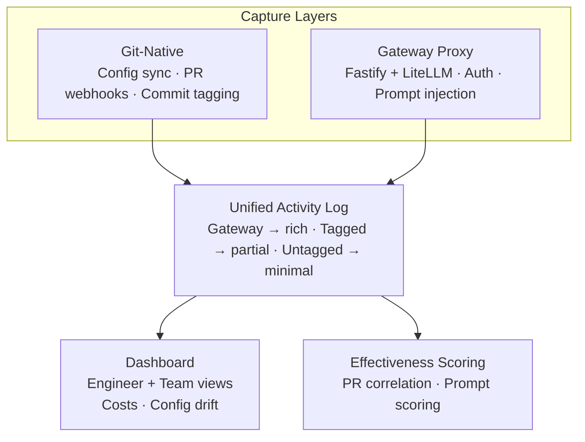

# AIRails

**Self-hosted AI governance for engineering teams.**

One platform to unify AI conventions, track usage across every tool, and connect AI activity to real code outcomes — whether your team uses Claude Code, Copilot, Cursor, Codex, or direct API calls.

---

## The Problem

Multiple engineers. Multiple AI tools. Zero shared conventions, zero visibility, zero learning.

Existing solutions (LiteLLM, Helicone, Portkey) only capture API-routed traffic. They can't see Claude Code, Copilot, or Codex — the tools engineers actually use. **You can't govern what you can't see.**

## How AIRails Solves It

Two capture layers feeding one unified system:

| Layer | How it works | What it captures |
|-------|-------------|-----------------|
| **Git-Native** | Manages native config files (CLAUDE.md, .cursorrules, copilot-instructions.md) from a single `.airails/` source of truth. Tracks PR outcomes via webhooks. | All tools — including closed-loop ones |
| **Gateway Proxy** | Transparent reverse proxy with prompt injection, token logging, and cost tracking. | API calls, Cursor, Continue.dev |

Both layers feed into the same activity log, the same dashboard, and the same effectiveness scoring engine.

**One-liner:** Existing tools tell you what your team spent on AI. AIRails tells you whether it was worth it.

---

## Architecture



## Services

| Service | Stack | Port | Role |
|---------|-------|------|------|
| **gateway** | Fastify | 8080 | API proxy — intercepts, enriches, logs AI calls |
| **litellm** | LiteLLM | 4000 | Model-agnostic LLM routing |
| **dashboard** | Next.js | 3000 | Web UI — engineer and team analytics |
| **webhook** | Fastify | 8081 | GitHub/GitLab webhook receiver |
| **postgres** | PostgreSQL 17 | 5432 | Primary data store |
| **redis** | Redis 8 | 6379 | BullMQ job queue |

## Key Concepts

- **Products** — top-level isolation boundary (one product = one team/project, many repos)
- **Prompt Registry** — versioned prompt templates with base + engineer overrides
- **Config Sync** — `.airails/` directory generates native tool configs (CLAUDE.md, .cursorrules, etc.)
- **Effectiveness Scoring** — correlates AI activity with PR outcomes (review cycles, acceptance rate)
- **Data Richness Spectrum** — gracefully degrades from full gateway data to Git-only signals

---

## Quick Start

```bash
# Clone and configure
cp .env.example .env

# Start all services
docker compose up -d

# Verify
curl localhost:8080/health   # gateway
curl localhost:3000           # dashboard
curl localhost:8081/health   # webhook
curl localhost:4000/health   # litellm
```

## Development

```bash
npm install            # install all workspaces
npm run build          # turbo build
npm run dev            # turbo dev (all services)
npm run lint           # turbo lint
npm run typecheck      # turbo typecheck
```

## Project Structure

```
airails/
├── packages/
│   ├── gateway/       # API proxy (Fastify)
│   ├── dashboard/     # Web UI (Next.js)
│   ├── webhook/       # Git event receiver (Fastify)
│   ├── cli/           # Engineer CLI (Commander.js)
│   └── shared/        # Shared types & schemas
├── prisma/            # Database schema & migrations
├── litellm/           # LiteLLM proxy config
├── phases/            # Implementation specs (13 phases)
└── docker-compose.yml
```

## Multi-Product Isolation

AIRails uses **products** as the top-level isolation boundary. Each product represents a team, project, or business unit. A single instance serves many products with complete data separation.

- API keys are product-scoped — a key for Product A cannot access Product B
- Every database query includes `WHERE productId = ...`
- Webhooks route to the correct product via repository ownership
- Role-based access (OWNER/LEAD/MEMBER) is enforced per product

See [docs/multi-product.md](docs/multi-product.md) for details.

## Documentation

| Guide | Description |
|-------|-------------|
| [Setup](docs/setup.md) | Installation and first product |
| [Configuration](docs/configuration.md) | `.airails/config.yml` reference |
| [Multi-Product](docs/multi-product.md) | Product isolation model |
| [Roles](docs/roles.md) | OWNER/LEAD/MEMBER permissions |
| [Config Sync](docs/sync.md) | Sync engine documentation |
| [Commit Tagging](docs/tagging.md) | Voluntary AI usage tagging |
| [API Reference](docs/api.md) | All endpoints |
| [Contributing](docs/contributing.md) | Development setup & PR guidelines |

---

## License

[MIT](LICENSE)
